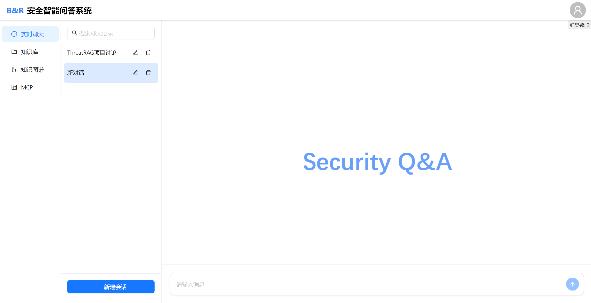

# ThreatRAG

ThreatRAG is a Retrieval-Augmented Generation (RAG) framework for Cyber Threat Intelligence (CTI). It combines a vector knowledge base and a Neo4j knowledge graph to provide security analysts with an intelligent threat intelligence analysis and Q&A tool.



## Features

- **Intelligent Retrieval**: Vector similarity search with BAAI/bge-m3 embeddings, optional bge-m3 reranker, and query rewriting based on conversation history
- **Hybrid RAG**: Jointly retrieves from the vector knowledge base and the knowledge graph, then merges and ranks the results for the LLM
- **Document Management**: Multi-format document upload (TXT, MD, DOC, DOCX, PDF) with automatic chunking, embedding, and PostgreSQL metadata storage
- **Knowledge Graph Construction**: LLM-based entity and relationship extraction from unstructured CTI reports, with XML-formatted prompts and a Neo4j persistence pipeline
- **Graph Query & Augmentation**: Entity search, BFS subgraph expansion, shortest path queries, and graph-based RAG augmentation in chat
- **Streaming Chat**: SSE-based streaming responses with optional reasoning content support (e.g. DeepSeek-R1)
- **Session & Auth**: Redis-backed chat sessions and bcrypt-based user registration / login
- **Multi-LLM Provider**: Built-in support for DeepSeek and SiliconFlow (DeepSeek-V3, DeepSeek-R1, Qwen2.5, etc.)
- **Health Check & Service Monitor**: `/health` endpoint reports Milvus, Neo4j, Redis and PostgreSQL status
- **One-Click Deployment**: Docker Compose bundles PostgreSQL, Redis, Neo4j, Milvus, etcd, MinIO and the API service

## Project Architecture

```
ThreatRAG/
├── main.py                       # Service entry point
├── config.yaml                   # Unified configuration (model, DB, server, KG, KB, etc.)
├── requirements.txt
├── docker-compose.yml            # Production deployment
├── docker-compose.dev.yml        # Development deployment (with hot-reload)
├── Dockerfile
├── data/                         # Runtime data (graph_data, knowledge_base, uploads)
├── docs/                         # API docs, CTI samples, architecture docs
├── kg/
│   └── data_process/             # Offline KG extraction pipeline
│       ├── batch_inference/      # Batch LLM inference helpers
│       ├── extracted_entities/   # Raw extracted entities
│       ├── extracted_json/       # Extracted JSON, constraint fix & Neo4j import
│       ├── ner/                  # NER / graph model definitions
│       ├── prompts/              # XML extraction prompts (CN / EN)
│       └── save_to_neo4J/        # Neo4j import script
├── models/                       # Local model weights (bge-m3, etc.)
├── scripts/                      # SQL / shell helpers (init-postgres.sql, init-services.sh, ...)
├── src/
│   ├── api/                      # FastAPI server & routers
│   │   ├── server.py
│   │   └── routers/              # chat, knowledge, graph, user/auth
│   ├── config/                   # Config loader
│   ├── core/
│   │   ├── chat/                 # ChatEngine, SessionManager
│   │   ├── graph/                # GraphStore, GraphSearcher, GraphExtractor, Neo4jClient
│   │   ├── knowledge/            # KnowledgeBase, VectorStore
│   │   ├── retrieval/            # Retriever, QueryProcessor, ResultMerger
│   │   └── user/                 # User management
│   ├── models/                   # chat_model, embedding_model, rerank_model, graph_model, orm_models
│   ├── prompts/                  # Graph extraction prompt (CN)
│   ├── services/                 # chat / knowledge / graph / user services
│   └── utils/                    # database_manager, postgres_manager, vector_db_manager, llm_client, xml_parser, ...
└── tests/                        # unit, integration, e2e tests
```

## Quick Start

### 1. Environment Setup

```bash
git clone https://github.com/yourusername/ThreatRAG.git
cd ThreatRAG
pip install -r requirements.txt
```

### 2. Configuration

Copy and edit the environment file:

```bash
cp .env.example .env
```

Key variables in `.env`:

```
# Base LLM
BASE_MODEL=deepseek-ai/DeepSeek-V3

# Neo4j
NEO4J_URL=bolt://localhost:7687
NEO4J_USERNAME=neo4j
NEO4J_PASSWORD=12345678
NEO4J_DATABASE=neo4j

# Milvus
MILVUS_HOST=localhost
MILVUS_PORT=19530

# PostgreSQL
POSTGRES_HOST=localhost
POSTGRES_PORT=5432
POSTGRES_DB=knowledge_db
POSTGRES_USER=postgres
POSTGRES_PASSWORD=12345678

# Redis
REDIS_URL=redis://localhost:6379

# LLM providers
SILICONFLOW_API_KEY=sk-xxxxxxxx
SILICONFLOW_API_BASE=https://api.siliconflow.cn/v1
DEEPSEEK_API_KEY=sk-xxxxxxxx
```

Runtime switches are also available in `config.yaml` (knowledge base, knowledge graph, reranker, query rewrite, model provider, etc.).

### 3. Start the Service

#### Option A: Docker Compose (recommended)

```bash
docker-compose up -d
```

This starts PostgreSQL, Redis, Neo4j, Milvus (etcd + MinIO) and the ThreatRAG API service.

The API will be available at `http://localhost:8000`, with interactive docs at:

- Swagger UI: `http://localhost:8000/docs`
- ReDoc: `http://localhost:8000/redoc`

#### Option B: Run Locally

Start the required services (PostgreSQL, Redis, Neo4j, Milvus) yourself, then:

```bash
python main.py
```

### 4. Database Access

| Service     | Port  | URL / Tool                          | Default Credentials |
| ----------- | ----- | ----------------------------------- | ------------------- |
| Neo4j       | 7474  | http://localhost:7474/browser/      | `neo4j` / `12345678` |
| Milvus      | 19530 | pymilvus / Attu                     | (depends on config) |
| PostgreSQL  | 5432  | `psql -h localhost -U postgres`     | `postgres` / `12345678` |
| Redis       | 6379  | `redis-cli`                         | (no auth)           |

## Module Overview

### API Service (`src/api`)

FastAPI application exposing the following routers:

- `POST /chat/` — streaming chat (SSE) with optional KB / graph retrieval
- `GET /chat/session/{id}`, `DELETE /chat/session/{id}`, `GET /chat/sessions`, `PUT /chat/session/{id}/title` — session management
- `GET /chat/models/{provider}` — list available models
- `GET /knowledge/`, `POST /knowledge/`, `DELETE /knowledge/{db_id}` — manage knowledge bases
- `POST /knowledge/{db_id}/upload` — upload documents (TXT, MD, DOC, DOCX, PDF)
- `POST /knowledge/{db_id}/documents` — add documents directly
- `POST /knowledge/{db_id}/query`, `POST /knowledge/query-test` — vector retrieval / query test
- `GET /graph/`, `GET /graph/node`, `GET /graph/nodes`, `GET /graph/stats` — graph inspection
- `POST /graph/query` — graph retrieval by entity list
- `POST /graph/extract` — synchronous entity / relation extraction from raw text
- `POST /graph/extract-and-save` — async extraction + persistence
- `POST /auth/register`, `POST /auth/login`, `GET /auth/user/{id}`, `POST /auth/change-password` — user auth

### Chat Engine (`src/core/chat`)

- `ChatEngine` — orchestrates retrieval, prompt assembly, streaming generation, and session history
- `SessionManager` — Redis-backed session persistence with title auto-generation

### Retrieval (`src/core/retrieval`)

- `Retriever` — async fan-out to entity extraction, KB query and graph query, then builds an augmented prompt
- `QueryProcessor` — keyword extraction, query cleaning, expansion and intent analysis
- `ResultMerger` — merge, deduplicate, rank and summarize KB and graph results

### Knowledge Base (`src/core/knowledge`)

- `KnowledgeBase` — manage knowledge bases: create, delete, upload, add documents, query
- `VectorStore` — Milvus wrapper for collection management and vector search
- Document metadata (DB, documents, chunks, chat sessions, messages, vector tasks) is stored in PostgreSQL via SQLAlchemy ORM

### Knowledge Graph (`src/core/graph`)

- `GraphStore` — Neo4j driver wrapper for entity / relationship persistence
- `GraphSearcher` — entity search, BFS subgraph expansion, shortest paths, statistics
- `GraphExtractor` — call LLM with XML prompts (`xml_prompt_cn.md` / `xml_prompt_en.md`) to extract entities and relationships from CTI text
- `Neo4jClient` — low-level Neo4j read / write helpers

### KG Data Processing (`kg/data_process`)

Offline pipeline that turns raw CTI reports into Neo4j graph data:

1. `batch_inference/` — prepare / submit / process LLM batch jobs
2. `extracted_json/` — store extracted JSON; `fix_relationship_constraints.py` enforces entity-type / relationship-type constraints
3. `save_to_neo4J/save_to_neo4j.py` — bulk-import the constrained JSON into Neo4j

The XML prompt defines 9 entity types (attacker, victim, event, asset, vul, ioc, tool, file, env), 9 relationship types, MITRE ATT&CK tactic labels, and a temporal ordering for each entity.

## Frontend

The companion web frontend lives in a separate repository:

[https://github.com/rstarall/br-cti-chat](https://github.com/rstarall/br-cti-chat)

## Documentation

- `docs/API/api.md` — REST API reference
- `docs/database-architecture.md` — multi-database architecture overview
- `docs/neo4j-node-label-design.md` — Neo4j node label design notes
- `docs/CTI/` — sample threat intelligence reports

## Contributing

Contributions and issues are welcome. Please:

1. Fork the project
2. Create a feature branch (`git checkout -b feature/amazing-feature`)
3. Commit your changes (`git commit -m 'Add some amazing feature'`)
4. Push to the branch (`git push origin feature/amazing-feature`)
5. Open a Pull Request

## License

This project is licensed under the MIT License — see the [LICENSE](LICENSE) file for details.
